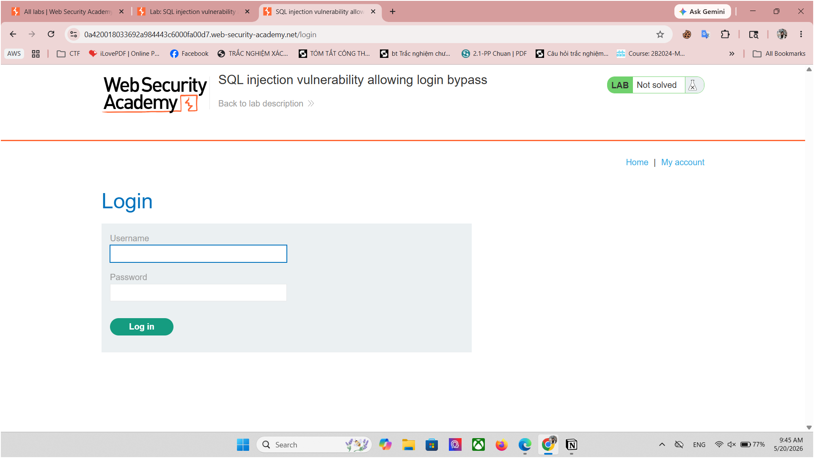

# Lab: SQL injection vulnerability allowing login bypass

# 1. Tổng Quan

| **Tên lỗ hổng** | SQL Injection trong chức năng đăng nhập  |
| --- | --- |
| **Phân loại** | CWE-89: SQL Injection |
| **Tham số ảnh hưởng** | `username` (POST parameter) |
| **Công cụ sử dụng** | Burp Suite Professional v2025.4.4 |

# 2. Mô Tả

Ứng dụng web tồn tại lỗ hổng SQL Injection trong chức năng đăng nhập. Khi người dùng nhập tên đăng nhập và mật khẩu, ứng dụng xây dựng và thực thi câu truy vấn SQL bằng cách nối trực tiếp giá trị do người dùng nhập vào mà không có bất kỳ biện pháp bảo vệ nào.

**Ví dụ câu SQL gốc được thực thi  như sau:**

```jsx
SELECT * FROM users WHERE username='[input]' AND password='[input]'
```

→ Tham số `username` được chèn trực tiếp vào chuỗi SQL mà không qua xử lý hoặc tham số hóa. Kẻ tấn công có thể chèn cú pháp SQL độc hại vào trường `username` để bỏ qua hoàn toàn điều kiện kiểm tra mật khẩu, đăng nhập vào bất kỳ tài khoản nào mà không cần biết mật khẩu thực sự.

# 3. Các Bước Tái Hiện (Proof of Concept)

**Bước 1: Truy Cập Trang Đăng Nhập Và Quan Sát**

Mở trình duyệt và truy cập vào trang đăng nhập của ứng dụng.



**URL quan sát được:**

```jsx
[https://0a420018033692a984443c6000fa00d7.web-security-academy.net/login](https://0a420018033692a984443c6000fa00d7.web-security-academy.net/login)
```

→ Kết quả: Trang hiển thị form đăng nhập với hai trường `Username` và `Password`. Thử đăng nhập với tài khoản bất kỳ → hệ thống trả về thông báo **"Invalid username or password."**

**Bước 2: Chặn Bắt Request Bằng Burp Suite**

Bật Burp Suite và cấu hình proxy. Nhập thông tin đăng nhập bất kỳ rồi click **Log in**, Burp Suite sẽ ghi lại request POST tương ứng trong tab **HTTP History**:


Phải chuột vào request này và chọn **"Send to Repeater"** (phím tắt `Ctrl+R`) để gửi sang module Repeater phục vụ kiểm tra thủ công.

**Bước 3: Kiểm Tra Lỗ Hổng (Xác Nhận Có Thể Tấn Công)**

Trong Burp Suite Repeater, sửa tham số `username` bằng cách thêm dấu ngoặc đơn ( `'` ) vào sau giá trị:

`csrf=...&username=administrator'&password=123`


Nhấn **Send**. Máy chủ trả về:

```jsx
HTTP/2 500 Internal Server Error
```

Lỗi này xác nhận rằng dấu ngoặc đơn đã phá vỡ cú pháp SQL, chứng tỏ tham số `username` đang bị lỗ hổng SQL Injection.

**Bước 4: Inject Payload Để Bypass Đăng Nhập**

Chỉnh sửa request để chèn payload SQL vào tham số `username`:

**thả Payload vào hàm login**

```jsx
administrator'--
```

ta có như sau:

```jsx
csrf=...&username=administrator'--&password=123
```


Nhấn **Send**. Máy chủ trả về:

```jsx
HTTP/2 302 Found
Location: /my-account?id=administrator
```

Trình duyệt được chuyển hướng đến trang My Account với `tên đăng nhập : administrator` , đăng nhập thành công mà không cần mật khẩu. Lab hiển thị trạng thái Solved.


Nháy chuột phải, click vào Show response in browser.


Chuột phải vào link → Copy link address → Mở tab mới → Paste →solved lab thành công.


### 4. Phân Tích Payload

Payload được chèn vào thay đổi câu truy vấn SQL như sau:

| **Thành Phần** | **Ý Nghĩa** | **Tác Động** |
| --- | --- | --- |
| `administrator` | Tên tài khoản mục tiêu | Xác định tài khoản cần đăng nhập vào |
| `'` | Dấu ngoặc đơn | Đóng chuỗi SQL gốc, thoát ra khỏi giá trị username |
| `--` | Comment SQL | Comment toàn bộ phần còn lại của câu truy vấn, loại bỏ điều kiện `AND password='...'` |

**Câu SQL thực tế được thực thi trên máy chủ:**

```jsx
SELECT * FROM users WHERE username='administrator'--' AND password='123'
```

Vì phần `AND password='123'` bị comment bỏ, cơ sở dữ liệu chỉ kiểm tra điều kiện `username='administrator'` và trả về bản ghi tương ứng, cho phép đăng nhập thành công mà không cần mật khẩu đúng.

# 5. Tác Động

#### **Tác Động Kỹ Thuật:**

- Bỏ qua hoàn toàn cơ chế xác thực (authentication bypass)
- Đăng nhập vào bất kỳ tài khoản nào chỉ cần biết tên đăng nhập
- Chiếm quyền điều khiển tài khoản quản trị viên (`administrator`)
- Có thể mở rộng tấn công để liệt kê toàn bộ người dùng trong hệ thống
- Tiền đề cho các tấn công leo thang đặc quyền nghiêm trọng hơn

#### **Tác Động Kinh Doanh:**

- Kẻ tấn công có toàn quyền truy cập hệ thống với vai trò quản trị viên
- Rủi ro rò rỉ toàn bộ dữ liệu người dùng và thông tin nhạy cảm
- Vi phạm pháp luật/tuân thủ nếu dữ liệu cá nhân (PII) bị truy cập trái phép
- Tổn hại nghiêm trọng đến uy tín thương hiệu nếu sự cố bị công khai

# 6. Nguyên Nhân Gốc Rễ

- Giá trị tham số `username` được nối trực tiếp vào chuỗi câu truy vấn SQL (string concatenation)
- Không sử dụng Parameterized Queries / Prepared Statements
- Không có cơ chế kiểm tra/lọc đầu vào (input validation)
- Không có WAF hoặc quy tắc bảo vệ SQL metacharacters
- Thông báo lỗi hệ thống bị lộ ra ngoài, giúp kẻ tấn công xác nhận lỗ hổng

**Ví dụ đoạn code bị lỗi:**

```jsx
String query = "SELECT * FROM users WHERE username='"
             + username   // <-- Trực tiếp chèn đầu vào người dùng
             + "' AND password='" + password + "'";
```

# 7. Khuyến Nghị Khắc Phục

- **Sử Dụng Parameterized Queries (Quan Trọng Nhất):**Thay thế nối chuỗi SQL bằng câu truy vấn tham số hóa. Đây là biện pháp hiệu quả nhất, đảm bảo đầu vào người dùng luôn được xử lý như dữ liệu, không bao giờ được thực thi như lệnh SQL:

```jsx
PreparedStatement stmt = conn.prepareStatement(
    "SELECT * FROM users WHERE username=? AND password=?");
stmt.setString(1, username);  // An toàn - không thể inject SQL
stmt.setString(2, password);
```

- **Sử Dụng ORM Framework:** Các framework ORM như Hibernate (Java), SQLAlchemy (Python), hoặc Django ORM tự động sử dụng parameterized queries, giảm thiểu nguy cơ SQL Injection một cách hệ thống.
- **Kiểm Tra Và Lọc Đầu Vào (Input Validation):** Triển khai kiểm tra đầu vào phía máy chủ theo danh sách trắng (allowlist). Từ chối bất kỳ đầu vào chứa các ký tự SQL đặc biệt như: `' " ; -- /* */`
- **Triển Khai Web Application Firewall (WAF):** WAF có thể phát hiện và chặn các mẫu SQL Injection phổ biến như một lớp bảo vệ bổ sung. Lưu ý: WAF không thể thay thế parameterized queries — đây chỉ là biện pháp phòng thủ theo chiều sâu (defense-in-depth).

### 8. Tài Liệu Tham Khảo

- OWASP SQL Injection: [https://owasp.org/www-community/attacks/SQL_Injection](https://owasp.org/www-community/attacks/SQL_Injection)
- CWE-89 - SQL Injection: [https://cwe.mitre.org/data/definitions/89.html](https://cwe.mitre.org/data/definitions/89.html)
- PortSwigger - SQL Injection Login Bypass: [https://portswigger.net/web-security/sql-injection/lab-login-bypass](https://portswigger.net/web-security/sql-injection/lab-login-bypass)
- OWASP Testing Guide: [https://owasp.org/www-project-web-security-testing-guide/](https://owasp.org/www-project-web-security-testing-guide/)
- OWASP SQL Injection Prevention Cheat Sheet: [https://cheatsheetseries.owasp.org/cheatsheets/SQL_Injection_Prevention_Cheat_Sheet.html](https://cheatsheetseries.owasp.org/cheatsheets/SQL_Injection_Prevention_Cheat_Sheet.html)

**LƯU Ý:**

**MỘT SỐT DB YÊU CẦU KHOẢNG TRẮNG THÌ TA CÓ THỂ TEST NHƯ SAU:**

**administrator'#        -- MySQL
administrator'/*       -- MySQL / PostgreSQL**
